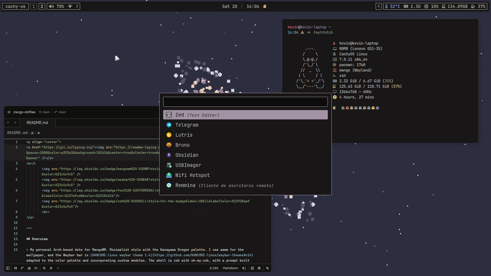

 
        
        
        
        
         

## Overview

> My personal Arch-based dots for MangoWM. Minimalist style with the Kanagawa Dragon palette. I use awww for the wallpaper, and the Waybar bar is [HANCORE-linux waybar theme 1.4](https://github.com/HANCORE-linux/waybar-themes#v14) adapted to the color palette and incorporating custom modules. The shell is zsh with oh-my-zsh, with a prompt built using Starship, and I use foot as the terminal. I recommend a Nerd Font so everything looks nicer — I use JetBrains Mono Nerd Font.

## Dependencies

| Category                 | Packages                                |
| ------------------------ | --------------------------------------- |
| **Window Manager**       | mango                                   |
| **Status Bar & Widgets** | waybar, awww                            |
| **Terminal**             | foot, fastfetch                         |
| **Launchers**            | rofi, rofi-bluetooth, networkmanager    |
| **Lock & Session**       | swaylock, wlogout, swayidle             |
| **Notifications**        | swaync                                  |
| **Audio**                | pulseaudio, pamixer, pavucontrol        |
| **Display & Power**      | brightnessctl, power-profiles-daemon    |
| **Clipboard**            | wl-clipboard, cliphist, wl-clip-persist |
| **Screenshots**          | grim, slurp, wayfreeze, satty           |
| **Utilities**            | ncdu, upower, wlsunset, jq              |
| **Fonts & Theme**        | ttf-jetbrains-mono-nerd                 |
| **System**               | waybar-module-pacman-updates, zsh       |

### Cursor

> I use [pxsor](https://github.com/melisapo/pxsor) as my cursor theme.

## Keybinds

| Keybind          | Action                              |
| ---------------- | ----------------------------------- |
| `SUPER + Space`  | App launcher (rofi)                 |
| `SUPER + V`      | Clipboard history (cliphist + rofi) |
| `SUPER + Return` | Terminal (foot)                     |
| `SUPER + E`      | Editor (Zed)                        |
| `SUPER + B`      | Browser (Brave)                     |
| `SUPER + F`      | File manager (Thunar)               |
| `SUPER + O`      | Obsidian                            |
